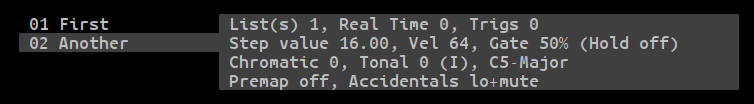

# Multi Arp Command and Menu Reference: Pattern Commands

**BN - Dec 17, 2017**

* [**edit**](#edit)
* [**play**](#play)
* [**new**](#new)
* [**copy**](#copy)
* [**clear**](#clear)
* [**delete**](#delete)
* [**undo**](#undo)
* [**lock**](#lock)

## edit

Synonyms: ***e***

Parameters: ***nn***

If you leave out the pattern number the [Pattern Menu](menu_ref_pattern.md) will open and you can browse patterns and lists using the cursor keys.

Typing *edit* followed by a pattern number sets ***edit focus***, which shows which pattern is set to receive subsequent pattern commands.

There are two ways to see which pattern has *edit focus*. The first place to look is in the Pattern Summary Panel (below) where the current pattern and step list are shown on the *Edit* line.

The other place to check is the Pattern Browser (below). The highlighted item in the list on the left shows the pattern with *edit focus*, with its contents summarized in the panel on the right.

---
## play

Synonyms: ***cue***

Parameters: ***nn***

Changes the playing pattern. The pattern will change on the next quantum boundary.

***Note***

You do not actually need to type either *play* or *cue* for this command to work. If pattern chaining is off, just typing the pattern number on the command line will change the pattern in the same way.

---
## new

Synonyms: (none)

Parameters: ***[label]***

Adds an empty pattern to the end of the pattern list. Anything you type after the word 'new' will be used as a label. The empty pattern will have one empty *step list* and no *real time lists*. *Edit focus* will be set to point to the new pattern.

---
## copy

Synonyms: (none)

Parameters: (none)

This copies the pattern with *edit focus*. The copy is placed at the end of the pattern list. The copy will have its position reset and its label will have the word 'copy' appended.

If ***lock*** is enabled, *edit focus* doesn't change.

---
## clear

Synonyms: (none)

Parameters: (none)

Clears the pattern which currently has *edit focus*. All *step lists* and *real time lists* are deleted. The pattern's scale table and trig list is reset.

A copy of the pattern is placed on the *undo* list before it is cleared. If the ***undo*** is used, the old pattern will be added to the end of the pattern list. The cleared pattern will remain in place.

---
## delete

Synonyms: ***del***

Parameters: ***[all]***

Deletes the pattern with *edit focus* and places a copy on the *undo list*.

If ***delete all*** is used, all patterns are deleted at once.

WARNING: There is NO confirmation for this command in either form.

---

## undo

Synonyms: (none)

Parameters: (none)

Whenever a pattern is deleted or cleared, a copy of it is placed on the *undo* list. This command takes that copy and puts it back at the end of the pattern list.

***Notes***

If other patterns have been created since a pattern was deleted, the *undone* pattern will have a different pattern number.

If ***delete all*** was used, you have to use *undo* for once for each pattern to get them all back.

---
## lock

Synonyms: (none)

Parameters: ***on***, ***off***

Lock sets *edit focus* to follow the currently playing pattern, so if the playing pattern is changed, *edit focus* changes too. This works when pattern chain mode is active, too.

If ***edit*** is used to set edit focus directly, *lock* is turned off automatically.
