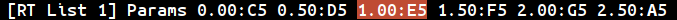

# Multi Arp Command and Menu Reference: Real Time List Menu

**BN - Dec 17, 2017**

The ID of the current real time list is shown on the left. Next to this is an item named 'Params' which leads to the further parameters for this realtime list. After this is a list of all notes in the current real time list.

### Menu Items

* [**Params**](#parameters-sub-menu)
* [**Notes**](#item-2)

## Params

Key combinations:

|| Action |
| :--- | :--- |
| **up/down** |Changes *edit focus* to the next or previous real time list. (This only works if the menu was opened from the *Pattern Menu*.)|
| **enter** | Opens [Parameters sub-menu](#parameters-sub-menu), (see below). |
| **back-space** | If the menu was opened from the *Pattern Menu* this will return to that menu. |

---
## Notes

When a note is highlighted you can change its start position or open the  [Note Edit Menu](menu_ref_step_list.md#note-edit)  to change its pitch, velocity or duration.

Key combinations:

|| Action |
| :--- | :--- |
| **up/down** |Changes the start position - beat within *real time quantum* - for the note. Up/Down will change the value in steps of 0.1. Hold down shift to use steps of 0.01. If you change the start position so that it overlaps neighbouring notes, the order of notes in the menu will also change, but the note you are editing will remain highlighted.|
| **enter** | Opens the [Note Edit Menu](menu_ref_step_list.md#note-edit). This is the same note edit menu that opened from the *Step List Menu*. |
|**shift-delete**|Deletes the highlighted note.|
|**ctrl-delete**|Undoes the most recent deletion and puts the note back in its original place in the list.|
| **back-space** | If the menu was opened from the *Pattern Menu* this will return to that menu. |

---
# Parameters sub-menu

From here you can change the behaviour or the current *real time list*, who's ID is shown on the left. You can change the playback rate (*Mul*), or loop start and length positions (*Loop S/Q*), which enables looping of just one part of the list.

### Menu Items
* [**Start**](#start)
* [**Quantum**](#quantum)
* [**Multiplier**](#multiplier)
* [**Window Mode**](#window-mode)

---
## Start

Key combinations:

|| Action |
| :--- | :--- |
| **up/down** |Changes the play start point for the loop. Units are *beats*, and the default step  is 0.1. Hold down *shift* to change the value in steps of 0.01.|
| **enter**, **backspace** | Returns to previous menu. |
| **delete** | Resets field to default value, which is zero. |

---
## Quantum

Key combinations:

|| Action |
| :--- | :--- |
| **up/down** |Changes the loop length, or *real time quantum*, for this list. Units are *beats*, and the default step  is 0.1. Hold down *shift* to change the value in steps of 0.01.|
| **enter**, **backspace** | Returns to previous menu. |
| **delete** | Resets field to default value, which is the quantum when the list was captured or imported. |

---
## Multiplier

Key combinations:

|| Action |
| :--- | :--- |
| **up/down** |Changes the playback rate as a multiplier or the overall tempo of the sequencer. The value is changed in steps of 0.1. Hold down *shift* to change the value in steps of 0.01. Negative values are allowed, in which case the list will play back in reverse order, though you may have to adjust start position to hear anything.|
| **enter**, **backspace** | Returns to previous menu. |
| **delete** | Resets field to default value, which is the quantum when the list was captured or imported. |

---
## Window Mode

This parameter controls how notes are gathered for quantized playback (which, is under review at the moment, and may be turned off at time of writing.) 

In the current method, the quantization window is determined by step length, and the two modes **centered** and **ahead** determine whether events are moved forwards or backwards to the nearest step position, or are always moved backwards to the current position. The third mode, **centered small** should probably be ignored.

Key combinations:

|| Action |
| :--- | :--- |
| **up/down** |Changes the window mode.|
| **enter**, **backspace** | Returns to previous menu. |
