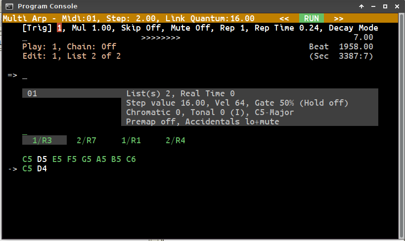
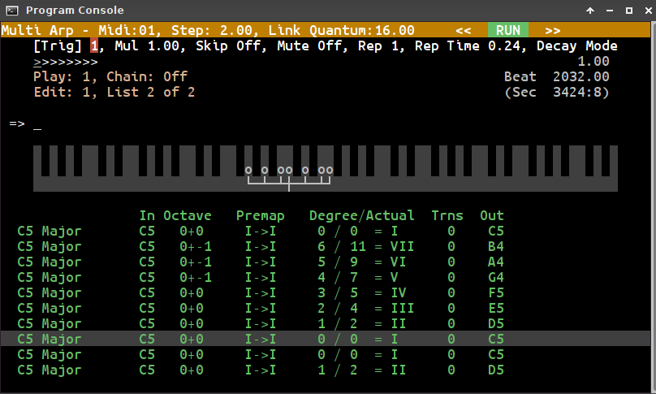

# Multi Arp

## Design Overview

**BN - Dec 16, 2017**

This is doc expands on the 'readme' file. What follows is a summary of where things are in the current implementation.

## Concepts

* A ***pattern*** contains one or more *step lists* and/or *real time lists*. There is no predetermined limit to the number of lists of either kind within a pattern.

* A ***step list*** is a series of notes, chords or rests played out with regular timing. Step lists have no predetermined length. The timing of a step list is controlled by ...

* The ***step value*** controls the rate of step list playback and indeed the overall ‘pulse’ of the sequencer. Step value is the conversion rate between the internal sequencer pulse and Ableton Link’s beat value. A value of 4 is essentially a quarter note, 8 is an eighth-note and so on, and values 3, 7, etc divide a four beat bar as you would expect. Step values (and beat values) can be non-integer.

* Multiple step lists within a pattern are either *interleaved* - one step from each list is played in rotation - or played according to a *trig list*.

* A ***trig list***, one per pattern, allows for any combination of steps from each step list to be played simultaneously. Trig lists themselves can be of any length. Individual *trig stages* can generate additional copies of an event to be scheduled at repeating times during and after a step. This enables ratcheting effects, midi echos and one shot arpeggiated chords generated using intervals from the current pattern scale (see later).

* A ***real time list*** is a more traditional looper-style thing intended for the capture of phrases to be played alongside the step list data. Note events are captured and stored using beat values according to the Ableton Link timeline and are played back, quantized or unquantized, independently of step value. Playback rate for each real time list can be varied, as can loop length and start offset. Real time lists also support import of midi files. Step lists and trig lists have no interaction with real time lists.

* A pattern has other *properties* including step value, default gate length and default note velocity. They also have a *scale* and a *feel*. These  are transformations applied on-the-fly to note data as it is played back. These are both also very much explorational items and I don’t consider them anywhere near final.

* ***Scale*** transforms map notes onto major, minor and modal scales allowing transpositions based on intervals within those scales. (The problem of how to handle accidentals - notes that are not part of the current scale - is very much up in the air. I’m trying to see how much I can do without defining an absolute key for any pattern or phrase but I will at some point try an alternative approach and say that note data is always entered in relation to a key and see if this leads to a more consistent set of rules.)

* ***Feel***, or swing, applies a time shift to steps that fall between beats as defined by Ableton Link. A feel map defines any number of markers which control how events are swung between beats. One marker gives the familiar ‘jazzy’ swing, but two or more markers opens up the kinds of micro-timing I find in West African music and doubtless other areas or world music. The feel map doesn’t vary from beat to beat. Feel does not affect real time data.

* Pattern ***chains*** allow patterns to be played in any order. Patterns can be switched on bar boundaries as defined by Ableton Link, or can be switched naturally when their own internal cycles come to completion. Steps in the pattern chain will play in succession or a ‘goto next’ value can be set. Chain steps can be repeated a number of times before switching or set to repeat indefinitely.

## Midi Note entry

Note entry is via midi keyboard. There are two step entry modes.

***Step*** mode requires use of the PC keyboard to enter rests and close a phrase. Chords or single notes are played on the midi keyboard.

***Quick*** mode involves holding down a note or notes. On release of the last key, the note set is entered as a monophonic sequence. There is no way to enter chords or rests in this mode.

There is also a ***real time*** entry mode which operates as a standard midi looper.

Creation and editing of all note data is possible from within the app, but this is only intended for small additions or minor tweaks.

## User Interface

The current UI is a hodgepodge of make do and mend that’s grown as I’ve needed it. As it stands, the UI is text mode, 80 by 25 characters.

A simple horizontal ***menu*** system exists for some functionality. For everything else you have to use the ***command line*** within the app.

The top line of the display is a ***status bar*** showing midi channel, step value, quantum value and Run/Stop/Record state. The background colour for the status bar changes to orange if one of the two step input modes is active, and red for real time record.

Next comes the ***menu bar***, which may be empty. (More on this in the [next section](#more-about-menus).)

Row three contains the ***progress bar***. The bar adapts to the current situation. The overall number of divisions  comes from current Ableton Link quantum value - essentially the loop length - but the size of the cursor is determined by step value. Depending on the extremes of timing settings, it could be anything from a tiny dot travelling across sixty four steps or more, to the whole thing flashing on and off once for every beat or bar.

To the right of the progress is the current ***beat value*** within the current quantum. Below beat value on the right is ***pattern beat value***, which may be different to global beat. Below that is ALSA sequencer queue time, though this isn't particularly useful.

Below the progress bar for two lines and extending from the left of the screen to most of the central area is the ***pattern status panel***, showing the currently playing pattern and pattern with ***edit focus***. When pattern chaining is active this area changes to show pattern chain progress.

Row seven, with the prompt symbol, is the ***command line***. Row six above shows any immediate ***status messages***. It will also show midi input even when no record modes are active, or it'll just show the ncurses code for the last key press (which is diagnostic info I'm still finding useful).

The lower two thirds of the display below the command line can change completely depending on ***display mode*** (changed with tab or shift-tab).

In the first two modes, which are slight variations on the same theme, lines nine to twelve show a scrollable ***pattern list*** on the left, with ***pattern summary*** to the right of the list. (You can see this in the image above.)

Below that, step lists and real time lists are shown, with an arrow cursor to the left showing which of them has ***edit focus***. The list with edit focus is either the subject of the current menu, or will be the target for other commands not supported by the current menu.

When the sequencer is running, step lists will either scroll from right to left with the current position appearing left-most, or will scroll right to left about a central position (depending on which of the first two display modes is selected). Real time lists will always scroll to the left, with the current list position (which may be different to both pattern and global beat values) in the left most column.

The third display mode attempts to show ***transposition activity***, showing active note shifts for the current step on a keyboard - looking remarkably effective for text mode display, even if I say so myself - and a detailed list of note transforms below (which should scroll, but doesn't).

## More about Menus

Menus are loaded for certain commands only. (I could extend them to all commands for a complete hierarchy, but haven't done so yet.) Some menus have submenus.

With all menus, use the ***left***/***right*** arrow keys to navigate - there's an orange highlight cursor - and ***up***/***down*** to change an option or value.

***Enter*** will select a submenu if applicable, and ***backspace*** takes you up to the previous level. (I'd prefer Esc for this, but X terminals add some extra processing with Esc which gets in the way.)

Menus are also used to display lists of parameter values. If the list itself can be edited, ***shift-left***/***shift-right*** will insert a new entry to the left or right of the cursor. In some cases, ***ctrl-left***/***ctrl-right*** will copy an entry and ***shift-delete*** will delete it. (In a couple of places ***ctrl-delete*** will undo a deletion.)

If a parameter is has decimal places, ctrl and shift with up/down will change in tenths and hundredths, respectively.

## Saving and loading patterns

There is no conventional file open/save mechanism. Pattern data is transferred in and out using ***Copy***/***Paste*** key combinations. Single patterns or all patterns can be copied out, but there’s a much finer level of control about what can be pasted back.

The data format is plain text and the intention is to use your favourite text editor to manage things and of course, transferring data between instances is just as simple.

## Architecture

Within the app everything runs from the UI thread using a timed render loop. Linux’ ALSA Sequencer is used for timing and event scheduling, including a callback to trigger each step of the sequencer. Ableton Link is interrogated to determine when events should be scheduled.

The UI thread polls for keyboard or midi input and processes one character or one event at a time. Midi input is processed immediately. This includes the step callback. If keyboard input is a special key that triggers an action it is processed immediately. Other characters are accumulated into a command string to be processed when Enter is received.

With each iteration of the render loop event data is gathered and calculated, and scheduled to be played out by ALSA during the next step window. This includes scheduling a callback to trigger processing for the following step as the current step plays out. In this way processing for each step always begins one whole step ahead of the actual schedule time of those events.

BN
