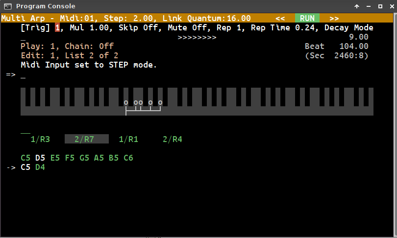

# Multi Arp
*Another step in the Great Midi Adventure!*

**BN - Dec 16, 2017**

(I’ve always thought of ‘Multi Arp’ as an interim name, but after several months now I haven’t found anything else and the search must continue.)

## What is it?

* ***Non-linear pattern sequencer*** with the focus on live exploration, improvisation and (sooner or later) performance.

* *Non-linear* means having more than one list of events playing at a time. The lists are interleaved, or played all at once, or played in any combination in between.

* A real time ***midi looper*** adds additional elements to a pattern.

* A single instance of the app plays one polyphonic pattern on one midi-channel. Run multiple, synchronized instances to play on different channels.

* ***Ableton Link*** synchronization protocol is used to keep everything playing together. You do not need to have Ableton Live or any of its components for this to work.

## User Interface

The UI is text mode, 80 by 25 characters. This avoids the use of mouse/touch on a cramped table top or flimsy laptop stand, but also comes from a sense of nostalgia on my part - think *Voyetra Sequencer Plus* on DOS, or even *Fairlight*.

Use the ***command line*** within the app to control the sequencer. A simple horizontal ***menu*** system exists for some commands and extends their functionality.

Pattern data is transferred in and out using ***copy***/***paste*** key combinations. There is no conventional file open/save mechanism.

## Midi Note entry

Note entry is via midi keyboard. There are two *step modes* and one 'looper-style' *real time mode*.

You *can* add and change note data from within the app, but this is only intended for small additions or minor tweaks.

## Architecture

Within the app everything runs from the UI thread using a timed render loop. Linux’ ALSA Sequencer is used for timing and event scheduling. Ableton Link is used to determine when events should be scheduled.

## Platform Requirements

* Written in C++ with a few bits that look like plain old C.

* Built with gcc for Linux 64 bit (C++14, by default).
Heavy use of the C++ Standard Library, in particular string, vector and map.

* The IDE used for this source tree is CodeBlocks.

* Double precision floating point maths for Ableton Link and other parts of the sequencer (though this is problematic in areas where consistent conditional branching is required and a switch to integers in these places would be useful).

* UI uses NCurses library.

* ALSA sequencer for internal timing and midi event scheduling, receipt and delivery.

* Ableton Link for synchronization with other instances of itself, and of course other apps using Link on the current IP LAN segment.

* Linux utility *xclip* is used for copy/paste.

## More information

You can read a more detailed overview of things [here](Doc/readmore.md). The beginnings of a command reference is [here](Doc/command_ref.md).

BN
